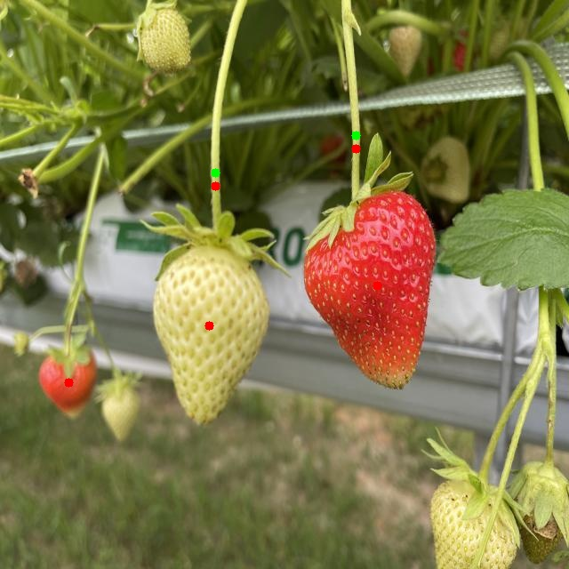

# Ultralytics YOLOv8 Inference

This repository contains four applications for running object detection and segmentation using the Ultralytics YOLOv8 model: image, video, camera and webcam source for inference.

## Getting Started

1. Clone the repository
2. Install dependencies: `pip install ultralytics`

## Usage

### Image Inference

1. Open `imagepredict.py`
2. Change `model_path` and `source`
3. Adjust `conf` and `device` if needed
4. Run: `python imagepredict.py`

### Video Inference

1. Open `videopredict.py`
2. Change `model_path` and `source`
3. Adjust `conf` and `device` if needed
4. Run: `python videopredict.py`

### Live Stream Inference

1. Open `stream.py`
2. Change `model_path`
3. Adjust `conf` and `device` if needed
4. Run: `python stream.py`

### Camera Stream Inference
* We are using Intel D145 *
1. 'pip install pyrealsense2'
2. Open `camera.py`
3. Change `model_path`
4. Adjust `conf` and `device` if needed
5. Run: `python camera.py`

Streams RGB, Depth and Infared

### Predict.py

- Run inference on folder of images

Prints to console:

[
Processing: IMG_6891_JPG_jpg.rf.35d48ccaadce7e9edc093666974c7f9a.jpg
--------------------------------------------------
Detected strawberryNR | Confidence: 0.96 | Position: (235, 366)
Detected strawberryR  | Confidence: 0.94 | Position: (424, 321)
Detected stem         | Confidence: 0.94 | Position: (242, 209)
Detected stem         | Confidence: 0.94 | Position: (400, 167)
Detected strawberryR  | Confidence: 0.93 | Position: (77, 430)

Detection Summary:
strawberryNR | Count:  1 | Avg Confidence: 0.96
strawberryR  | Count:  2 | Avg Confidence: 0.93
stem         | Count:  2 | Avg Confidence: 0.94
]

## Notes

- Remove `device` parameter if not using GPU
- Ensure PyTorch is installed with CUDA and CuDNN support for GPU usage
